# Intervenção Humana, CSAT e Optimization Hub na Plataforma AWSales

Referência operacional para configurar, explicar e otimizar recursos de Intervenção Humana, CSAT e análise de suporte em campanhas da plataforma AWSales.

Este documento tem duas partes:

- Parte I (seções 1 a 12): como configurar e o que entra em cada artefato. É a referência de painel.
- Parte II (seções 13 a 18): de onde sair o dado real. Toda a camada de handoff, CSAT e Optimization Hub vive no banco NEO (db 7) e pode ser consultada de forma read-only. A Parte II traz o mapa de tabelas, os gotchas que custam tempo, uma bateria de queries prontas e o método para transformar motivo de transbordo em correção de checkpoint ou de FAQ. Verificado contra o banco em 2026-08-05.

Essas configurações ficam no painel da campanha e nas áreas administrativas da plataforma. Elas não devem ser escritas como configuração técnica dentro do checkpoint nem nas FAQs.

O checkpoint pode mencionar handoff humano apenas como regra de comportamento do agente, por exemplo:

```markdown
- [ ] Se o lead relatar erro de acesso após as orientações iniciais, coletar o e-mail de compra e encaminhar para atendimento humano.
```

O checkpoint não deve detalhar timers, fila, autosuspensão, redistribuição, CSAT, template Meta, Response Auditor ou Optimization Hub. Isso é configuração operacional da plataforma.

---

## 1. Visão rápida

| Recurso | Para que serve | Onde configura | Quando usar |
|---|---|---|---|
| Equipes | Define destino, horário, capacidade e regras operacionais do time humano | Admin / Equipes | Antes de ligar handoff em qualquer campanha |
| Transferência Manual | Permite que humano assuma uma conversa/ticket | Campanha / Intervenção Humana | Suporte, onboarding, vendas assistidas e exceções sensíveis |
| Transferência Automática 2.0 | IA transfere sozinha quando gatilhos críticos são detectados | Campanha / Intervenção Humana + Response Auditor | Pedido de humano, baixa confiança, hostilidade, falha crítica ou casos que exigem pessoa |
| IA intermediária na fila | Mantém o lead informado enquanto aguarda atendimento humano | Campanha / Handoff | Operações com fila ou horário de atendimento definido |
| Sequência de Inatividade | Retoma e encerra tickets quando o lead para de responder | Campanha / Suporte | Campanhas de suporte com fila ativa |
| Timers de Atendimento | Controla SLA do operador humano | Equipe / Campanha | Times com compromisso real de tempo de resposta |
| Redistribuição | Repassa tickets se operador ficar suspenso/inativo | Campanha / Timers | Equipes com mais de um operador e SLA ativo |
| Response Auditor | Audita respostas e aplica ações como retry, handoff, finalize e blacklist | Campanha / Gatilhos | Todas as campanhas com risco de resposta ruim, custo alto ou necessidade de controle |
| CSAT | Mede resolução e satisfação no fim do atendimento | Campanha / CSAT | Campanhas de suporte |
| Optimization Hub | Diagnostica gaps, custos, transbordo, tools e base de conhecimento | Optimization Hub | Otimização contínua de suporte |

Onde cada recurso deixa rastro no banco, para quando a otimização precisar de número em vez de impressão:

| Recurso | Tabela (db 7) |
|---|---|
| Equipes e operadores | `organization_teams`, `organization_teams_operators`, `organization_attendance_config` |
| Transferência manual e automática | `handoff_tickets` (`handoff_type` = `MANUAL_TAKEOVER` ou `AUTOMATED`) |
| Contexto do momento do transbordo | `handoff_snapshots` |
| Atendimento do operador | `handoff_assignments`, `operator_penalties` |
| Response Auditor | `response_auditor_telemetry` |
| CSAT | `csat_responses` |
| Optimization Hub | `tactical_analysis`, `strategic_analysis`, `improvement_suggestions` |
| Configuração da campanha | `campaigns.handoff_config`, `campaigns.csat_config` |

Na base inteira, 22.829 transbordos foram `AUTOMATED` contra 673 `MANUAL_TAKEOVER`. Transferência manual existe, mas 97% do handoff do sistema é a IA decidindo sozinha — o que reforça que o trabalho de otimização mora nos gatilhos, no checkpoint e nas FAQs, não no treinamento do operador para assumir conversa.

---

## 2. O que entra nos artefatos da campanha

### Entra no checkpoint

- Quando a IA deve tentar resolver sozinha.
- Quando deve coletar dados antes de encaminhar.
- Quando deve fazer handoff humano por comportamento.
- Como avisar o lead antes de transferir.
- Limites de escopo do agente.
- Regras de uso de tools, se a campanha tiver tools.

Exemplo:

```markdown
- [ ] Se o lead disser que não recebeu acesso, pedir o e-mail usado na compra e orientar a checar caixa de entrada e spam.
- [ ] Se após essa orientação o lead continuar sem acesso, encaminhar para atendimento humano com o contexto do problema.
```

### Não entra no checkpoint

- Configuração de equipes.
- Timer de operador.
- Autosuspensão.
- Redistribuição de ticket.
- Template Meta de CSAT.
- Perguntas de CSAT.
- Gatilhos técnicos do Response Auditor.
- Métricas do Optimization Hub.

### Entra nas FAQs

- Respostas para dúvidas reais do lead.
- Orientações de acesso, compra, produto, suporte ou política.
- Instruções para a IA responder com base no conhecimento da campanha.

### Não entra nas FAQs

- Configurações de Intervenção Humana.
- Configurações de CSAT.
- Regras internas de fila.
- Mensagens automáticas de avaliação.
- Explicações operacionais para o CS.

---

## 3. Configuração de equipes

Antes de ligar Intervenção Humana, a equipe precisa estar bem configurada. A IA pode usar a descrição da equipe para decidir o roteamento do ticket, então essa descrição não é só administrativa.

### Campos e decisões importantes

- Nome da equipe: nome interno claro, como Suporte Geral, Financeiro, Comercial ou Suporte Técnico.
- Identificador: nome técnico usado pela plataforma.
- Descrição: deve explicar quando aquela equipe deve receber tickets. Esta descrição ajuda a IA a decidir o destino quando há múltiplas equipes.
- Horário de atendimento: janela real em que a equipe responde.
- Valor mensal por operador: usado nas métricas de custo e economia do Optimization Hub.
- Limite máximo de tickets por operador: controla atribuição automática.
- Timeout de autosuspensão: define quando operador inativo é suspenso.

### Boa descrição de equipe

```text
Equipe responsável por dúvidas de acesso, login, área de membros, problemas técnicos, materiais não encontrados e erros de pagamento já concluído. Não recebe dúvidas comerciais antes da compra.
```

### Descrição fraca

```text
Equipe de suporte.
```

### Operador invisível

Operadores invisíveis não recebem atribuição automática, não entram na lógica de autosuspensão e não acumulam penalidade operacional por ficarem fora da fila.

Use operador invisível quando uma pessoa precisa poder assumir tickets manualmente, mas não deve receber tickets automaticamente.

### Limite de tickets e permissão manual

O limite de tickets por operador vale para atribuição automática. Um operador com permissão para assumir manualmente pode pegar tickets mesmo fora desse limite.

Se o cliente quer impedir que alguém assuma tickets manualmente, a correção não é mexer no limite. É ajustar a permissão do operador.

---

## 4. Intervenção Humana

Permite que atendentes humanos participem do atendimento quando necessário. O sistema gerencia fila de tickets, atribuição, tempos de resposta e encerramentos.

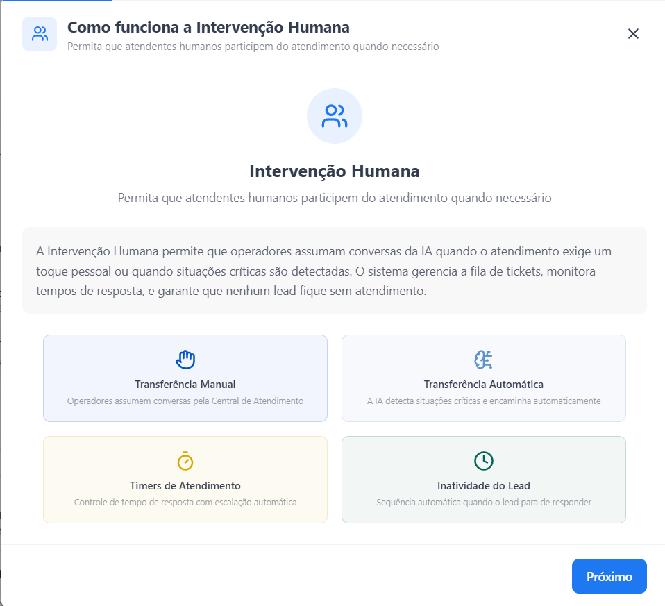

São mecanismos principais:

- Transferência Manual.
- Transferência Automática 2.0.
- IA intermediária na fila.
- Sequência de Inatividade.
- Timers de Atendimento.
- Redistribuição de Tickets.

### Regra de ouro

Só ligue Intervenção Humana se existir equipe responsável por atender.

Se o cliente não tiver operador, horário ou rotina de atendimento, ligar handoff pode piorar a experiência: a IA transfere, pausa e o lead fica esperando.

---

## 4.1 Transferência Manual

Operadores conseguem assumir tickets quando julgarem necessário. Ideal para casos que exigem empatia, negociação, validação interna ou conhecimento especializado.

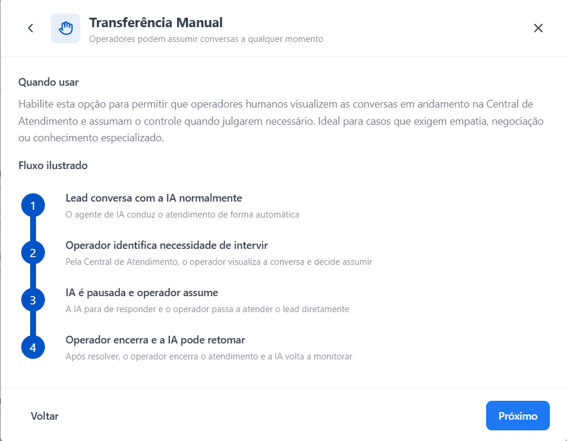

### Fluxo

1. Lead conversa com a IA normalmente.
2. Conversa entra em ticket ou fica disponível conforme permissões/visão do operador.
3. Operador identifica necessidade de intervir.
4. IA é pausada.
5. Operador assume.
6. Operador encerra e a IA pode retomar se houver nova mensagem e a campanha permitir.

### Quando ligar

- Suporte com equipe real.
- Onboarding pós-venda com risco de erro de acesso.
- Vendas assistidas com negociação humana.
- Casos de reclamação, financeiro, dados cadastrais ou exceções operacionais.

### Quando evitar

- Campanhas simples de show up ou lembrete.
- Operações sem operador disponível.
- Clientes que querem apenas "ver conversas", mas não têm processo de atendimento.

---

## 4.2 Transferência Automática 2.0

A IA analisa a conversa e transfere para fila humana quando um gatilho crítico é acionado.

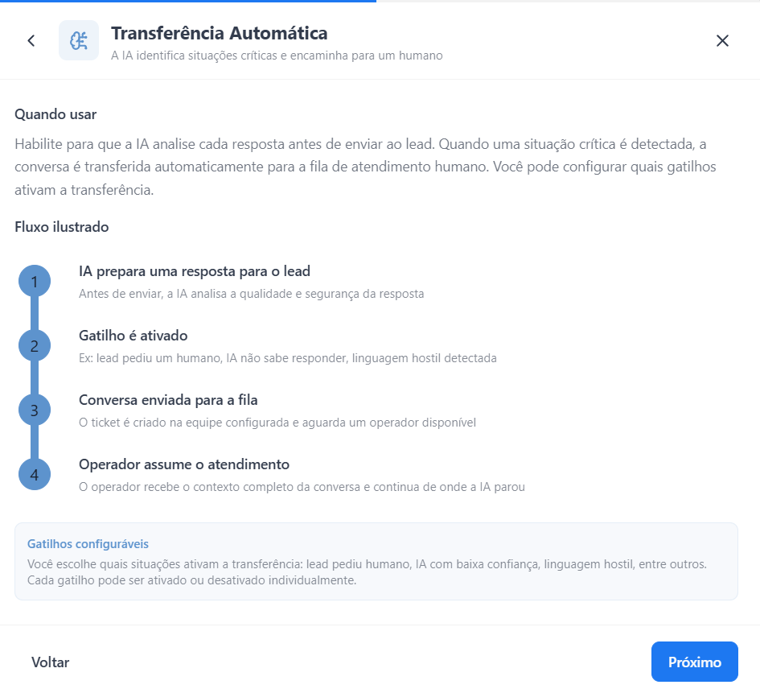

### Fluxo

1. IA prepara ou avalia a próxima resposta.
2. Response Auditor ou gatilho de handoff identifica risco.
3. Conversa é enviada para uma ou mais equipes configuradas.
4. Operador assume o atendimento com contexto preservado.
5. IA permanece pausada enquanto o ticket humano estiver ativo.

### Gatilhos comuns

- Lead pediu humano.
- IA não sabe responder ou está com baixa confiança.
- Lead usa linguagem hostil/agressiva.
- Falha crítica de ferramenta.
- Caso financeiro/cadastral que exige validação humana.
- Pedido que foge do escopo da campanha.

### Múltiplas equipes de destino

A plataforma permite selecionar mais de uma equipe de destino. Nesse caso, as descrições e orientações por equipe ficam ainda mais importantes.

Exemplo:

- Suporte Técnico: acesso, login, área de membros, erro de vídeo, material não encontrado.
- Financeiro: reembolso, segunda via, cobrança, pagamento, nota fiscal.
- Comercial: upgrade, plano, negociação, renovação.

Se as descrições forem vagas, a IA pode rotear ticket para a equipe errada.

### Orientação de mensagem de transferência

A mensagem de transferência deve ser natural e honesta, mas sem expor falha interna.

Bom:

```text
Vou encaminhar seu caso para o time responsável conferir isso com mais segurança. Eles vão seguir por aqui com o histórico da conversa.
```

Evitar:

```text
A IA não conseguiu resolver, então vou transferir.
```

```text
Não sei responder isso.
```

### Cuidado em campanhas comerciais

Objeção comum não é motivo automático para handoff.

Preço, parcelamento, garantia, prazo e dúvidas de compra devem ser tratados pela IA quando estiverem cobertos por checkpoint e FAQs. Handoff comercial deve ficar para exceções reais: pedido de humano, reclamação forte, falha técnica ou negociação que o time humano de fato fará.

---

## 4.3 IA intermediária na fila

Quando o ticket já foi transferido e o lead está aguardando atendimento humano, a plataforma pode usar uma IA intermediária para manter o lead informado.

Essa IA pode comunicar contexto como:

- posição na fila;
- horário de atendimento da equipe;
- que a solicitação já foi encaminhada;
- que o lead não precisa repetir tudo.

### Quando usar

- Equipes com fila.
- Equipes com horário de atendimento definido.
- Operações em que a espera humana pode demorar.

### Por que importa

Sem acompanhamento, o lead sente que foi abandonado depois do handoff. A IA intermediária reduz ansiedade e evita novas mensagens repetidas que aumentam custo e volume.

### Cuidados

- Não prometer prazo exato se o SLA não estiver configurado.
- Não dizer que o atendimento é imediato se não for.
- Não tentar resolver novamente o caso se ele já foi enviado para humano por um gatilho crítico.

---

## 4.4 Sequência de Inatividade do Lead

Aplica-se durante atendimento humano. Se o lead para de responder, o sistema envia mensagens automáticas para retomar contato e pode encerrar o ticket ao final.

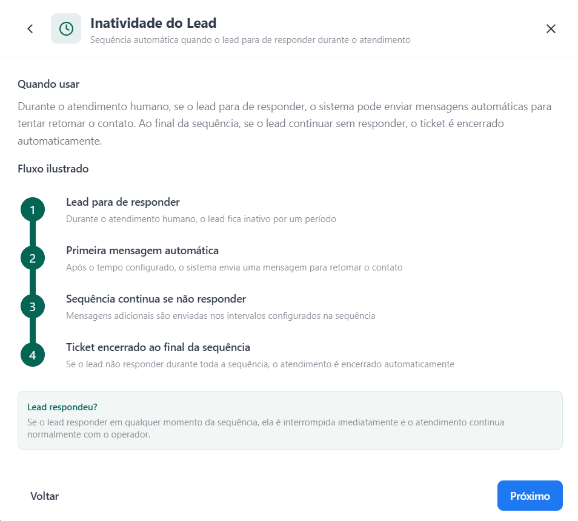

### Fluxo

1. Lead para de responder durante atendimento humano.
2. Após o tempo configurado, o sistema envia a primeira mensagem automática.
3. Sequência continua se ele não responder, em intervalos configurados.
4. Ticket é encerrado automaticamente ao final.

Se o lead responder em qualquer momento, a sequência é interrompida e o operador retoma.

### Bloco de encerramento em suporte

Campanhas de suporte possuem configuração específica de sequência de inatividade e bloco de encerramento. Esse bloco orienta como a IA ou o sistema encerra o atendimento quando não há continuidade.

Use mensagens curtas, úteis e sem cobrança.

Bom:

```text
Oi, passando para confirmar se você ainda precisa de ajuda por aqui.

Se sim, é só responder esta mensagem que seguimos o atendimento.
```

Evitar:

```text
Você não respondeu.
```

```text
Estamos aguardando seu retorno.
```

---

## 4.5 Timers de Atendimento

Timers garantem que o operador não deixe o lead esperando indefinidamente. O timer começa a contar a partir da última mensagem do lead.

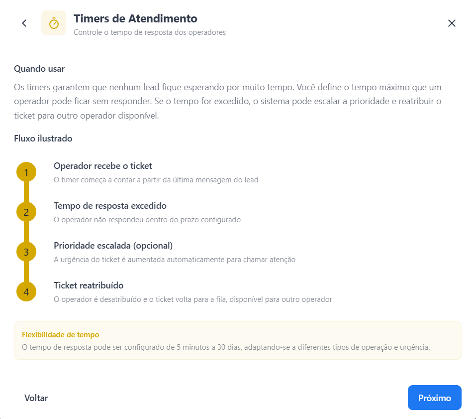

### Fluxo

1. Operador recebe ou assume o ticket.
2. Lead envia mensagem.
3. Timer começa a contar.
4. Se o operador não responder no prazo, o sistema pode escalar prioridade.
5. Dependendo da configuração, o operador pode ser suspenso/desatribuído.

Tempo configurável: de 5 minutos a 30 dias.

### Autosuspensão não é redistribuição automática

Se um operador ficar off ou ultrapassar o timeout, ele pode ser autosuspenso. Isso não significa que o ticket será transferido automaticamente para outro operador em todos os casos.

A redistribuição depende de configuração da campanha e disponibilidade de outros operadores.

### Quando ligar

- Cliente tem equipe com escala.
- Existe SLA real de resposta.
- Há volume suficiente para justificar controle operacional.

### Quando evitar

- Operação com poucos operadores.
- Cliente responde de forma irregular.
- Não existe compromisso de SLA.

### Recomendação prática

Não configure timer agressivo se a equipe não trabalha em tempo real. Um SLA honesto de 30 ou 60 minutos é melhor do que 5 minutos quebrados o dia inteiro.

---

## 4.6 Redistribuição de Tickets

Redistribuição depende dos Timers de Atendimento. Quando um operador está suspenso/inativo e o lead volta a falar, o ticket pode ser redistribuído para outro operador disponível.

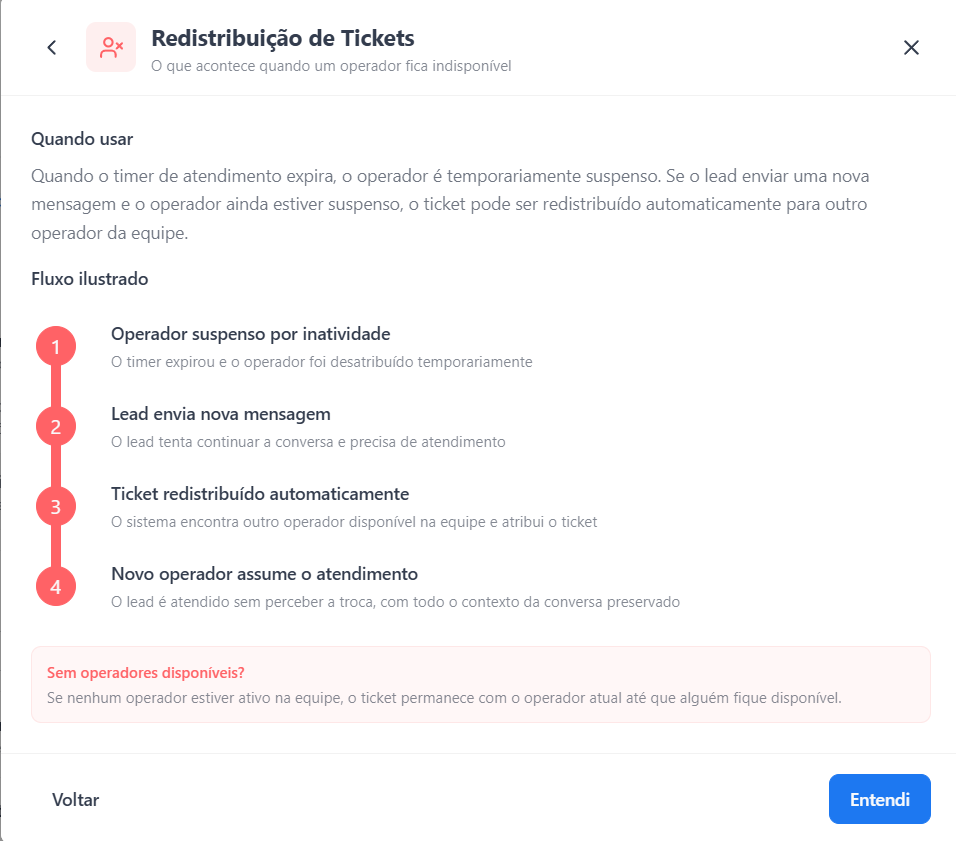

### Fluxo

1. Operador fica suspenso por inatividade.
2. Lead envia nova mensagem.
3. Ticket é redistribuído para outro operador disponível.
4. Novo operador assume com contexto preservado.
5. Lead não precisa explicar tudo de novo.

Se nenhum operador estiver ativo, o ticket permanece como está até alguém ficar disponível.

### Motivos reais de devolução à fila

O sistema grava o motivo em `handoff_tickets.last_return_reason`. Base inteira, 2026-08-05:

| Motivo | Ocorrências | O que significa |
|---|---|---|
| `OPERATOR_AUTO_SUSPENDED_INACTIVITY` | 937 | Operador estourou o timeout de autosuspensão e o ticket voltou |
| `CSAT_NOT_RESOLVED` | 479 | Lead respondeu "não resolveu" no CSAT e o ticket reabriu |
| `MAX_TIME_EXCEEDED` | 237 | Estourou o tempo máximo de atendimento |
| `OPERATOR_SUSPENDED_ON_LEAD_MESSAGE` | 88 | Lead voltou a falar com o operador já suspenso |

E o motivo de encerramento automático fica em `auto_resolved_reason`: `LEAD_INACTIVE` (1.129), `BULK_CLEANUP` (75), `AI_RESOLVED_POST_HANDOFF` (1).

Duas leituras que só aparecem com esse dado:

- `CSAT_NOT_RESOLVED` reabrindo ticket significa que o CSAT não é só medição: ele é um gatilho operacional. Um "não resolveu" volta trabalho para a fila. Campanha com CSAT ruim tem custo humano maior, não só nota pior.
- `OPERATOR_AUTO_SUSPENDED_INACTIVITY` como motivo dominante é o sintoma clássico de timer incompatível com a operação, descrito em 4.5. Ele é mensurável: se a maioria das devoluções tem esse motivo, o timeout está curto demais para a equipe real, não é o lead que sumiu.

### A única penalidade que o sistema aplica

`operator_penalties` tem 459 registros e um único motivo: `MAX_TIME_EXCEEDED`. Não existe penalidade por CSAT baixo, por devolução ou por volume. Ao explicar "penalidade operacional" para o cliente, é só isso.

### Quando ligar

- Equipe tem mais de um operador.
- Timers estão ligados.
- Qualquer operador consegue continuar o atendimento com base no histórico.

### Quando evitar

- Operação com um único operador.
- Atendimento altamente personalizado.
- Cliente sem equipe ativa.

---

## 5. Response Auditor e gatilhos

O Response Auditor audita respostas e situações da conversa para decidir ações de controle. Ele reduz a responsabilidade do copywriter/agente principal de decidir sozinho quando tentar de novo, finalizar, transferir ou aplicar blacklist.

Ele pode existir independentemente do handoff estar ligado.

### Ações possíveis

| Ação | O que faz | Uso típico |
|---|---|---|
| retry | Tenta gerar uma resposta melhor | Baixa qualidade, falta de CTA, resposta incompleta |
| handoff | Transfere para atendimento humano | Pedido de humano, risco alto, baixa confiança configurada para transferência |
| finalize | Encerra a sessão | Problema resolvido ou encerramento em suporte |
| blacklist | Marca o lead/status para não seguir atendimento normal | Hostilidade agressiva, excesso de mensagens, custo elevado |

### Catálogo real de gatilhos padrão

Levantado do banco em 2026-08-05, lendo `campaigns.handoff_config->'triggers'` de 2.132 campanhas. A coluna "ligado" mostra em quantas campanhas o gatilho está ativo, o que também indica o que é default de fábrica.

| Gatilho | Ação padrão | Campanhas com ele ligado | Observação |
|---|---|---|---|
| `hostile_user` | BLACKLIST (algumas usam HANDOFF) | 1704 | Ligado por padrão |
| `problem_resolved` | FINALIZE | 1704 | Dispara CSAT em suporte |
| `persona_break` | RETRY | 1704 | Quebra de persona |
| `human_request` | HANDOFF | 1704 | Pedido explícito de humano |
| `ai_dont_know` | HANDOFF (algumas usam RETRY) | 1703 | Maior gerador de transbordo do sistema |
| `json_code_leak` | RETRY | 1703 | Vazamento de JSON/sistema |
| `tool_failure` | RETRY | 1703 | Falha de ferramenta |
| `language_consistency` | RETRY | 1701 | Idioma errado |
| `false_promise` | RETRY (algumas HANDOFF) | 1693 | Promessa não sustentada |
| `lie_detector` | RETRY (algumas HANDOFF) | 1668 | Número/fato sem fonte autorizada |
| `high_cost` | BLACKLIST | 349 | Tem config `cost_threshold_usd` |
| `excessive_messages` | BLACKLIST | 186 | Tem config `message_threshold` |
| `low_confidence` | HANDOFF ou RETRY | 25 | Quase ninguém liga |
| `require_cta` | RETRY | 1 | Praticamente não usado |

Dois fatos que mudam a leitura:

- `low_confidence` está ligado em 25 campanhas de 2.132. Na prática, "baixa confiança" não é o gatilho que transborda: quem transborda é `ai_dont_know`. Ao explicar handoff para o cliente, não prometa um controle de confiança que ninguém usa.
- O Response Auditor roda mais checks do que o painel expõe como gatilho configurável. A telemetria (2,3 milhões de decisões desde 2026-05-05) registra também `url_hallucination`, `institutional_fabrication`, `checkpoint_content`, `checkpoint_violation`, `checkpoint_rule`, `checkpoint_mismatch`, `contextual_coherence`, `campaign_variables`, `knowledge_base_info`, `redundancy_loop`, `session_close_no_csat` e `retry_exhausted`. Ou seja, existe validação de aderência ao checkpoint acontecendo mesmo sem gatilho configurado — e ela gera RETRY, que quando esgota vira `retry_exhausted` e transborda.

### Volume real das ações (base inteira, desde 2026-05-05)

APROVADO sem intervenção: 1.811.415. As intervenções mais frequentes:

| Check | Ação | Ocorrências |
|---|---|---|
| `lie_detector` | RETRY | 217.963 |
| `false_promise` | RETRY | 59.342 |
| `persona_break` | RETRY | 43.023 |
| `tool_failure` | RETRY | 17.826 |
| `problem_resolved` | FINALIZE | 11.779 |
| `url_hallucination` | RETRY | 11.061 |
| `ai_dont_know` | HANDOFF | 10.984 |
| `institutional_fabrication` | RETRY | 10.963 |
| `checkpoint_content` | RETRY | 10.337 |
| `checkpoint_violation` | RETRY | 8.919 |
| `json_code_leak` | RETRY | 6.980 |
| `retry_exhausted` | HANDOFF | 4.347 |
| `hostile_user` | BLACKLIST | 2.876 |

Leitura prática: `lie_detector` sozinho responde por mais da metade dos RETRY do sistema. RETRY custa um turno inteiro de Copywriter. Se a campanha tem muito `lie_detector`, o problema quase sempre é número comercial que o agente precisa dizer e não está literal em nenhuma fonte autorizada — ou seja, falta na FAQ Produto ou no checkpoint. Isso é otimização de custo e de conversão ao mesmo tempo.

### Gatilhos personalizados

A plataforma permite criar gatilhos personalizados. No banco eles ficam em `handoff_config->'custom_triggers'` como lista de objetos com `id`, `name`, `prompt`, `status` e `enabled`, e aparecem no `handoff_reason` como `CUSTOM_CUSTOM_<hash>` ou com o nome que o CS deu.

Exemplo real em produção (suporte com fluxo de cancelamento):

```text
name: Cancelamento, reembolso e financeiro
prompt: Lead pede cancelamento, reembolso ou estorno, confirma o preenchimento do formulário
        ou cita prazo de 7 dias, CDC, Procon, chargeback ou contestação
status: HANDOFF
```

Para cada gatilho personalizado, descreva:

- qual comportamento deve ser detectado;
- exemplos de mensagens do lead;
- ação esperada;
- quando não acionar.

Exemplo:

```text
Nome: Pedido de suporte financeiro
Descrição: Acionar quando o lead pedir reembolso, segunda via, confirmar cobrança ou contestar pagamento já feito. Não acionar para dúvidas simples sobre preço antes da compra.
Ação: handoff para equipe Financeiro.
```

### Blacklist

Blacklist agora deve ser tratada como status aplicado pelo Response Auditor, não como decisão artesanal do copywriter.

Usos comuns:

- usuário hostil/agressivo;
- quantidade excessiva de mensagens em uma sessão;
- custo de atendimento elevado, conforme limite configurado.

Tenha mensagem de blacklist curta, neutra e sem confronto.

### Finalize em suporte

Em campanhas de suporte, o Response Auditor pode detectar problema resolvido, finalizar a conversa e acionar CSAT.

Esse fluxo é útil quando o lead confirma que conseguiu resolver, agradece ou encerra claramente o assunto.

---

## 6. CSAT (Avaliação de Satisfação)

CSAT coleta satisfação ao final de atendimentos de suporte. Em campanhas de suporte, ele fica sempre ativo e não pode ser desativado.

O lead normalmente recebe duas perguntas:

1. "Conseguimos resolver?"
2. "De 1 a 5, como avalia o atendimento?"

As respostas vão para os relatórios e para o Optimization Hub.

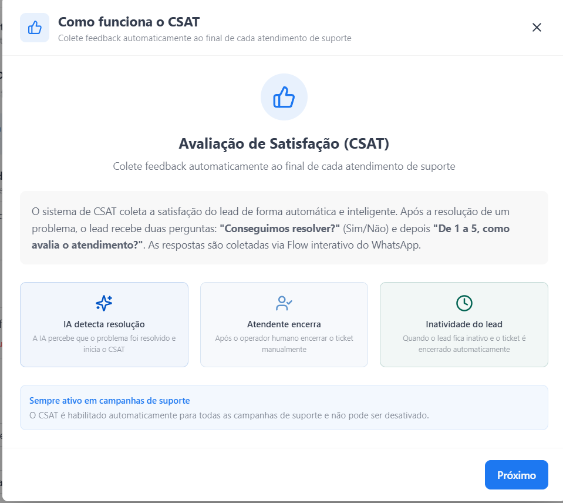

São três cenários principais que disparam CSAT:

- IA/Response Auditor detecta resolução.
- Atendente encerra o ticket.
- Ticket é encerrado por inatividade.

---

## 6.1 Template com Flow Interativo

O sistema cria um Flow do WhatsApp com duas telas: resolução Sim/Não e nota 1-5. O lead responde nos botões, sem precisar digitar.

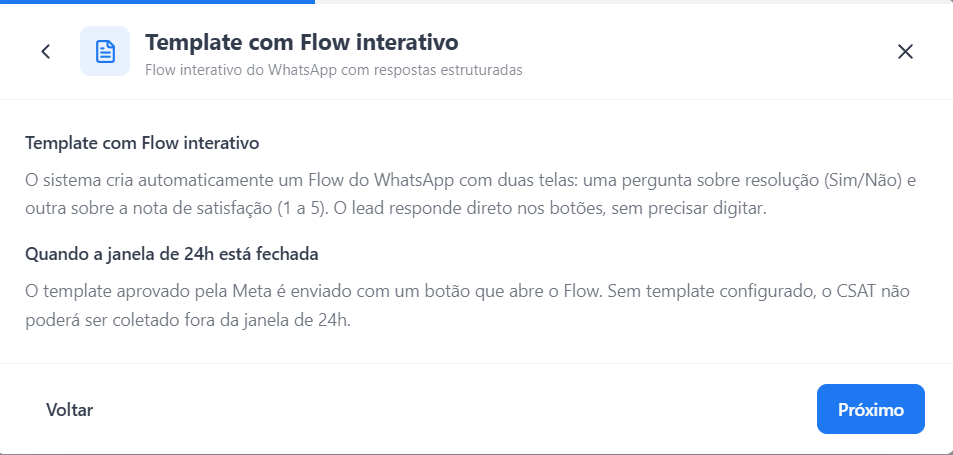

### Janela de 24h aberta

A pergunta pode ser enviada direto no chat.

### Janela de 24h fechada

É necessário um template aprovado pela Meta com botão que abre o Flow.

Sem template aprovado, o CSAT não é coletado fora da janela de 24h.

### Checklist do template

- Texto neutro.
- Sem indução de nota.
- Botão claro para abrir avaliação.
- Status aprovado na Meta antes de subir campanha.

---

## 6.2 Cenário 1: IA detecta resolução

A IA ou o Response Auditor identifica sinais de resolução.

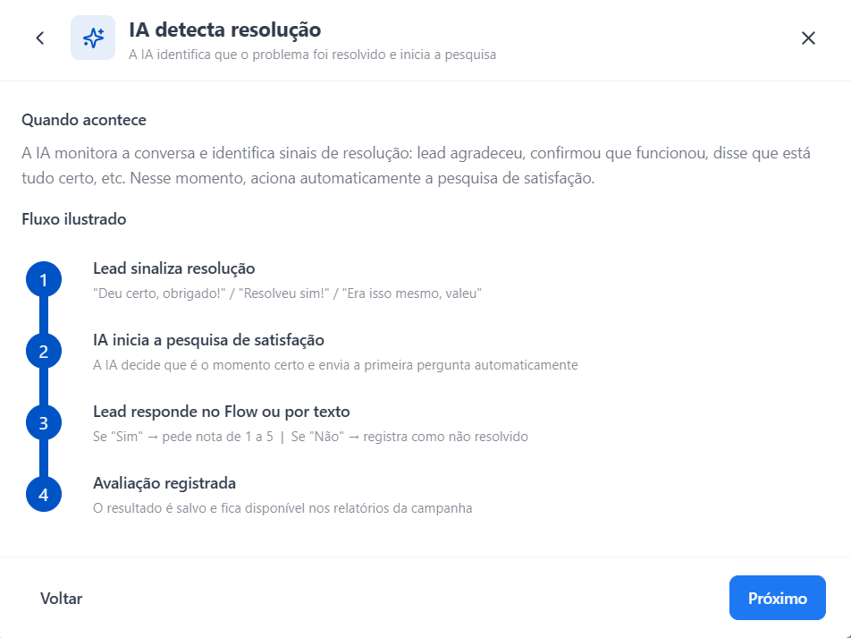

### Exemplos de sinais

- "Resolveu sim."
- "Era isso mesmo, obrigado."
- "Consegui acessar."
- "Agora funcionou."
- "Deu certo."

### Fluxo

1. Lead sinaliza resolução.
2. Sistema finaliza a conversa de suporte.
3. CSAT é enviado.
4. Lead responde no Flow ou por texto.
5. Avaliação é salva nos relatórios.

### Boa prática no checkpoint

O checkpoint pode orientar a IA a não prolongar atendimento resolvido.

```markdown
- [ ] Quando o lead confirmar que conseguiu resolver, encerrar de forma breve e não abrir novo assunto.
```

Não escreva no checkpoint que a IA deve enviar CSAT. O envio é configuração da plataforma.

---

## 6.3 Cenário 2: Atendente encerra o ticket

Quando Intervenção Humana está habilitada e o atendente clica em "Encerrar Atendimento", o sistema aguarda o delay configurado antes de enviar CSAT.

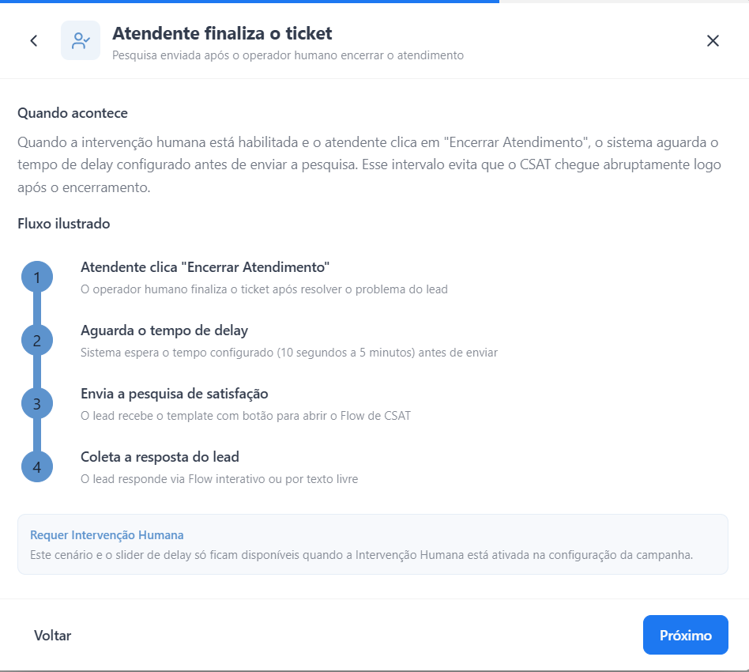

### Fluxo

1. Atendente clica em "Encerrar Atendimento".
2. Sistema aguarda o delay configurado.
3. Pesquisa de satisfação é enviada.
4. Lead responde via Flow ou texto livre.

### Delay

O delay evita que a pesquisa chegue abruptamente após o encerramento.

Faixa disponível: 10 segundos a 5 minutos.

Use delay curto em atendimento simples. Use delay maior quando a última mensagem humana é longa ou exige leitura.

### Atribuição da nota

Quando um operador assume a conversa, a avaliação pode ser atribuída ao operador no mapa de performance, mesmo que a IA tenha atendido antes.

Isso é importante para interpretar CSAT por operador: a nota pode refletir a experiência completa, não apenas a última mensagem humana.

---

## 6.4 Cenário 3: Encerramento por inatividade

Durante atendimento humano, se o lead fica inativo e o ticket é encerrado automaticamente pela sequência de inatividade, o CSAT pode ser disparado depois do fechamento.

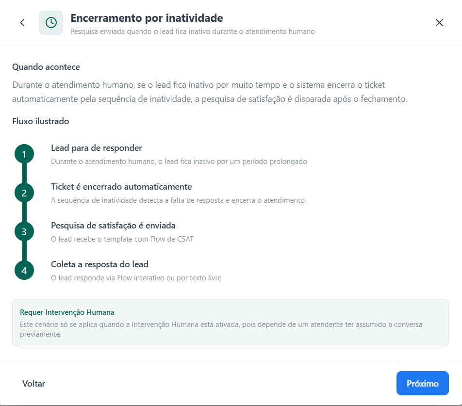

### Fluxo

1. Lead para de responder durante atendimento humano.
2. Sequência de inatividade roda.
3. Ticket é encerrado automaticamente.
4. Pesquisa de satisfação é enviada.
5. Resposta é coletada via Flow ou texto livre.

Esse cenário só se aplica quando houve atendimento humano ou ticket ativo.

---

## 6.5 Mudança de assunto durante o CSAT

Após enviar a pesquisa, o lead pode responder com um novo problema em vez de avaliar.

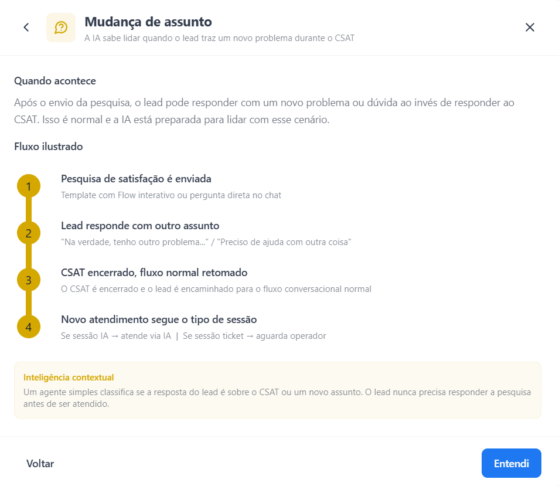

### Fluxo

1. Pesquisa é enviada.
2. Lead responde com outro assunto.
3. Classificador interno entende que não é avaliação.
4. CSAT é encerrado.
5. Fluxo conversacional normal é retomado.

O lead nunca precisa responder à pesquisa antes de ser atendido.

---

## 6.6 Campos de configuração do CSAT

- Mensagem introdutória do template: texto que aparece fora da janela de 24h com botão para abrir o Flow.
- Template de CSAT: template aprovado pela Meta.
- Pergunta de resolução.
- Pergunta de nota.
- Mensagem se não resolveu.
- Mensagem de agradecimento.
- Delay após encerramento humano.

No banco esses campos ficam em `campaigns.csat_config`, com as chaves `csat_template_id`, `csat_template_name`, `csat_template_status`, `csat_template_language`, `csat_template_waba_id`, `csat_flow_id`, `csat_flow_screen_id`, `csat_intro_message`, `msg_resolved_question`, `msg_rating_question`, `msg_not_resolved_followup`, `msg_thank_you` e `human_close_delay_seconds`. Dá para auditar `csat_template_status` de todas as campanhas de um cliente numa query só, antes de subir campanha.

### O que o CSAT realmente coleta (e o que a taxa de resposta significa)

`csat_responses` tem 26.905 registros desde 2026-04-02. Estados possíveis: `COMPLETED`, `TIMED_OUT`, `SKIPPED`, `AWAITING_RESOLVED`, `AWAITING_SCORE`. Método de envio: `FLOW`, `INTERACTIVE` ou `TEMPLATE`. Quem pediu: `AI` ou `SYSTEM_AUTO`.

O dado mais importante para alinhar expectativa com cliente: **`TIMED_OUT` é o estado mais comum na maioria das campanhas.** Numa campanha de suporte com volume alto medida em 45 dias, foram 656 `TIMED_OUT` contra 367 `COMPLETED` — taxa de resposta de cerca de 35%. E entre os que responderam, 196 disseram "sim, resolveu" com nota média 4,55, e 171 disseram "não resolveu" com nota média 1,92.

Três consequências:

- A nota média isolada engana. Ela é a média de duas populações distintas: quem foi resolvido (nota alta) e quem não foi (nota baixa). Sempre quebrar por `resolved_answer` antes de apresentar CSAT ao cliente.
- Taxa de resposta na casa dos 30% a 40% é o normal do canal, não um defeito da configuração. Não prometa amostra estatística com volume baixo.
- `TIMED_OUT` sem resposta não é neutro nem é insatisfação. Não conte como nota, e não conte como resolvido.

### Boas práticas de texto

Bom:

```text
Conseguimos resolver sua solicitação?
```

```text
De 1 a 5, como você avalia o atendimento?
```

Evitar:

```text
Seu atendimento foi excelente, certo?
```

```text
Dá uma nota 5 para ajudar nosso time?
```

---

## 7. Visão do cliente na Central de Atendimento

O cliente operador não vê todas as conversas em andamento da campanha.

Na Central de Atendimento, ele tem acesso principalmente a:

- Fila.
- Meus Atendimentos.

A aba "Conversas" completa, que mostra todas as conversas em andamento inclusive as que a IA atende sozinha, não está disponível na visão comum do cliente operador.

---

## 7.1 Aba Fila

Mostra conversas que estão na fila aguardando alguém da equipe assumir.

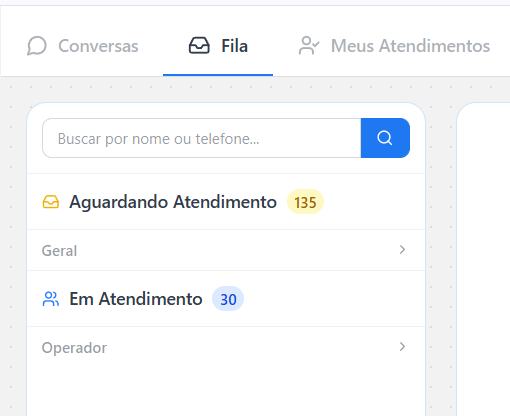

Pode incluir:

- Aguardando Atendimento: tickets sem operador atribuído.
- Em Atendimento: tickets já assumidos por alguém da equipe.

O operador pode pesquisar por nome ou telefone.

### Consequência operacional

O operador atua no que já virou ticket. Ele não visualiza livremente todas as conversas que a IA está atendendo sozinha.

---

## 7.2 Aba Meus Atendimentos

Mostra apenas conversas atribuídas ao operador logado.

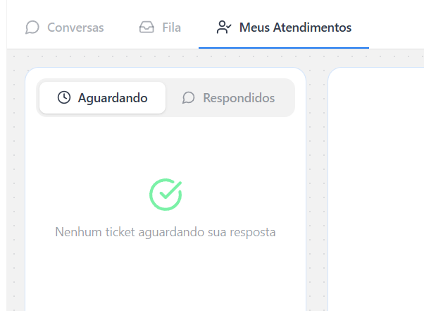

Normalmente ficam divididas em:

- Aguardando: lead respondeu e espera retorno do operador.
- Respondidos: operador já respondeu e aguarda retorno do lead.

### Alinhamento com cliente

Se o cliente disser "quero que minha equipe entre em qualquer conversa quando quiser", alinhe expectativa.

Na visão do cliente operador, ele não tem uma aba geral de todas as conversas da IA. Para atuar, a conversa precisa entrar na fila por handoff, por regra operacional disponível ou por permissão específica.

---

## 7.3 Permissões e ações em massa

Ações em massa, como assumir ou finalizar vários tickets, dependem de permissão de gerente.

Níveis de acesso podem limitar:

- visualizar tickets;
- criar anexos;
- transferir tickets;
- gerenciar atendimentos;
- executar ações em massa.

Antes de treinar o cliente, confirme qual perfil cada operador recebeu. Muitas dúvidas operacionais vêm de permissão, não de erro da campanha.

---

## 8. Optimization Hub

Optimization Hub é a área de diagnóstico e melhoria contínua para campanhas de suporte.

Ele processa atendimentos finalizados e apresenta insights para melhorar:

- checkpoint;
- tools;
- base de conhecimento;
- configuração de handoff;
- operação humana.

As sugestões do Hub não aplicam mudanças automaticamente na campanha. O CS precisa avaliar, transformar em artefatos e aplicar manualmente quando fizer sentido.

### O Hub é uma fila que ninguém puxou

Verificado em 2026-08-05: existem **2.574 sugestões geradas** em toda a base, e **100% delas estão em `PENDING_APPROVAL`**. Nenhuma foi aprovada, editada, rejeitada ou aplicada, em nenhum cliente, desde 2026-05-04.

Isso muda como usar o Hub. Ele não é um sistema que corrige a campanha sozinho nem um painel que o cliente vai consumir. É um analisador que já fez o trabalho pesado de agrupar padrão e ninguém foi buscar o resultado. Para o CS, isso é oportunidade: em qualquer campanha de suporte com algumas semanas de operação, provavelmente já existe uma lista pronta de FAQs faltando e de regras de checkpoint sugeridas, com estimativa de quantos handoffs por semana cada uma evitaria. A seção 15 mostra como puxar.

### Os três tipos de sugestão

| Tipo | Total na base | O que entrega |
|---|---|---|
| `KNOWLEDGE_BASE` | 1.314 | Par pergunta/resposta pronto para virar FAQ |
| `CHECKPOINT_RULE` | 863 | Regra de comportamento pronta, mais uma `fallback_message` |
| `TOOL_REQ` | 397 | Descrição de uma integração que resolveria o padrão |

Cada sugestão vem com `pattern_source` (quantas conversas sustentam o padrão e sobre o quê), `common_human_solution` (**o que o operador humano de fato fez para resolver**), `estimated_handoffs_avoided_weekly`, `confidence` e `ice_score`.

O campo `common_human_solution` é o mais valioso e o mais fácil de ignorar. Ele é a diferença observada entre o que a IA fez e o que o humano fez — que é exatamente a regra que falta no checkpoint. Exemplo real, campanha de suporte:

```text
pattern_source:        18 conversas sobre Login, Primeiro acesso e Recuperação de senha
                       com cliente já tendo tentado cache, aba anônima, outro navegador
                       ou outro dispositivo sem avanço
common_human_solution: O time para de repetir troubleshooting básico e passa a validar
                       e-mail, vínculo de conta, provisionamento ou encaminhar com o erro exato.
rule sugerida:         Quando o cliente informar que já tentou cache, aba anônima, outro
                       navegador ou outro dispositivo, não repita esse troubleshooting básico.
                       Reconheça a tentativa, troque a hipótese para e-mail, provisionamento,
                       permissão ou erro de cadastro e, se não houver avanço, peça o e-mail
                       de compra e escale com o erro exato.
```

Essa regra entra no checkpoint quase como está. É comportamento, não conhecimento, e não duplica FAQ.

### As tabelas do Hub estão vazias

`optimization_hub_daily_metrics`, `optimization_hub_operator_metrics` e `optimization_hub_metric_snapshots` existem no banco e têm **zero linhas**. Não são fonte de dado. O que o painel do Hub exibe é calculado a partir de `tactical_analysis` (por conversa) e `strategic_analysis` (por lote/dia). Ao investigar, ir direto nessas duas.

---

## 8.1 Métricas principais

Use o Hub para responder perguntas como:

- Qual a taxa de transbordo para humano?
- Quais tópicos mais geram handoff?
- A IA resolve mais que a equipe ou o contrário?
- Quais tools são chamadas e qual a taxa de sucesso?
- Qual a cobertura média da base de conhecimento?
- Qual o custo médio por atendimento humano?
- Qual a economia estimada gerada pela IA?
- Quais operadores resolvem mais tickets e com melhor avaliação?
- Quais temas derrubam CSAT ou sentimento?

### Métricas úteis

- Sessões abertas.
- Tickets em fila.
- Tickets atribuídos.
- Tempo médio de resposta.
- Taxa de transbordo.
- Taxa de resolução por IA.
- Taxa de resolução por equipe.
- CSAT.
- Sentimento, em escala de -1 a 1.
- Sucesso de ferramentas.
- Cobertura da base de conhecimento.
- Custo por atendimento.

---

## 8.2 Diagnóstico de conversas

Ao analisar uma conversa, o Hub pode mostrar:

- resumo do que a IA entendeu;
- motivo de intervenção;
- triggers de handoff acionados;
- execução de tools;
- sucesso ou falha das tools;
- cobertura da base de conhecimento;
- tópicos relacionados;
- impacto em CSAT e transbordo.

### Como interpretar

Se o motivo de handoff foi a IA não saber responder (`ai_dont_know`, o motivo campeão do sistema):

- Não assuma gap de FAQ. Ver seção 16: na maioria dos casos a base devolveu conteúdo e a IA transbordou mesmo assim.
- Verificar se a resposta da FAQ contém o fato ou se foi escrita como política interna.
- Verificar se o checkpoint instrui a IA a agir antes de transferir.

Se o motivo foi baixa confiança:

- Confirmar antes que o gatilho `low_confidence` está sequer ligado na campanha. Ele está ativo em 25 campanhas de 2.132.
- Verificar se a FAQ existe e está clara.
- Verificar se a pergunta da FAQ cobre a intenção do lead.

Se o motivo foi falha de tool:

- Verificar se a tool retorna erro HTTP ou resposta tratável.
- Preferir tools que retornem HTTP 200 com JSON estruturado de sucesso/falha.
- Atualizar checkpoint para explicar o que fazer com cada retorno.

Se o motivo foi solicitação de humano:

- Verificar se é um pedido legítimo ou se a IA gerou insegurança antes.
- Se for legítimo, manter handoff.
- Se o lead pediu humano porque a IA enrolou, corrigir checkpoint/FAQ.

Se o motivo foi hostilidade:

- Verificar se a IA provocou atrito por insistência, promessa falsa ou resposta fora de escopo.
- Ajustar tom, limite de insistência ou gatilho de blacklist/handoff.

---

## 8.3 Recomendações do Hub

O Hub pode sugerir ações como:

- criar novo documento na base de conhecimento;
- editar checkpoint;
- ajustar tool;
- revisar gatilho de handoff;
- melhorar descrição de equipe;
- alterar configuração de fila ou SLA.

### Regra de aplicação

Não aplique sugestão do Hub cegamente.

Antes de alterar a campanha:

1. Abra conversas reais que sustentam o insight.
2. Verifique se é padrão ou caso isolado.
3. Decida se a correção é FAQ, checkpoint, tool ou configuração.
4. Aplique no artefato correto.
5. Reavalie o impacto depois de novos atendimentos.

---

## 8.4 Exportações

O Hub pode oferecer relatório em PDF e exportação para Excel.

Use PDF para resumo executivo e alinhamento com cliente.

Use Excel quando precisar analisar:

- evolução diária;
- tempos de resposta;
- operadores;
- volume por tópico;
- motivos de intervenção;
- comparativos antes/depois.

Para análise interna do CS, a exportação não é o melhor caminho: as mesmas informações saem direto do banco com recorte de data e de campanha à escolha, e com granularidade que o relatório não entrega (a última pergunta do lead antes de cada transbordo, por exemplo). Ver Parte II. Reserve PDF e Excel para o que vai ser apresentado ao cliente.

---

## 9. Como aplicar em novas campanhas

Antes de configurar Intervenção Humana e CSAT, responda:

1. Existe equipe humana responsável por atender?
2. Qual equipe recebe cada tipo de ticket?
3. A descrição das equipes está clara o suficiente para roteamento?
4. Em quais horários cada equipe atende?
5. Existe SLA real de resposta?
6. Quantos tickets cada operador consegue atender?
7. Em quais situações a IA deve transferir?
8. Quais gatilhos devem ser retry, handoff, finalize ou blacklist?
9. O template de CSAT está aprovado?
10. Como o sucesso será acompanhado no Optimization Hub?

Se essas respostas estiverem indefinidas, alinhe com o cliente antes de subir a campanha.

---

## 9.1 Recomendação por tipo de campanha

### Suporte

Configuração recomendada:

- Transferência Manual: ON.
- Transferência Automática 2.0: ON.
- Gatilhos mínimos: pedido de humano, baixa confiança/IA não sabe, linguagem hostil.
- Equipes bem descritas e com horário definido.
- IA intermediária na fila: ON se houver espera.
- Sequência de Inatividade: ON.
- Timers: ON se houver SLA.
- Redistribuição: ON se houver Timers e mais de um operador.
- CSAT: ativo; validar template.
- Optimization Hub: revisar periodicamente.

No checkpoint:

- Instruir a IA a resolver dúvidas comuns.
- Instruir quando coletar dados mínimos antes de transferir.
- Não detalhar configuração técnica da Central.

### Onboarding pós-venda

Configuração recomendada:

- Manual: ON.
- Automática: ON para erro de acesso, compra não localizada, pedido de humano e linguagem hostil.
- IA intermediária: ON se houver fila.
- Inatividade: ON se houver atendimento humano.
- Timers: conforme SLA.

No checkpoint:

- A IA deve orientar acesso básico primeiro.
- Se o problema depender de conferência interna, coletar dados e encaminhar.
- Evitar jogar tudo para humano antes de tentar resolver o básico.

### SDR e agendamento

Configuração recomendada:

- Manual: opcional.
- Automática: ON apenas para casos sensíveis, pedido de humano, erro de tool ou lead muito qualificado pedindo contato direto.
- Timers: só se houver SDRs atuando na Central.
- Response Auditor: usar retry para respostas ruins antes de handoff.

No checkpoint:

- A IA deve qualificar e agendar com autonomia.
- Handoff humano deve ser exceção.

### Comercial, venda direta e recuperação

Configuração recomendada:

- Manual: opcional, se houver time comercial acompanhando.
- Automática: usar com parcimônia.
- Inatividade/Timers: só se houver operação humana real.
- Response Auditor: priorizar retry em baixa qualidade e handoff apenas em exceções.

No checkpoint:

- A IA deve tratar objeções comerciais comuns.
- Não transferir por qualquer objeção de preço.
- Transferir apenas pedido claro de humano, falha técnica, reclamação forte ou exceção que o time consiga resolver melhor.

### Lançamento e show up simples

Configuração recomendada:

- Normalmente manter Intervenção Humana OFF.
- Ativar somente se houver suporte operacional para acesso, grupo, live ou problema técnico.

No checkpoint:

- Manter foco no link principal.
- Dúvidas profundas ou fora do escopo podem ser encaminhadas para suporte, se existir.

---

## 9.2 Checklist de configuração

Use este checklist antes de liberar uma campanha com atendimento humano:

- [ ] Equipes criadas com nome, identificador e descrição útil.
- [ ] Horários de atendimento configurados.
- [ ] Valor mensal por operador preenchido se o cliente quiser métricas de economia.
- [ ] Limite de tickets por operador definido, se houver atribuição automática.
- [ ] Timeout de autosuspensão coerente com a operação.
- [ ] Operadores invisíveis configurados apenas quando fizer sentido.
- [ ] Permissões revisadas para assumir, transferir, gerenciar e fazer ações em massa.
- [ ] Transferência Manual ligada apenas se houver processo humano.
- [ ] Transferência Automática ligada com gatilhos compatíveis com a campanha.
- [ ] Múltiplas equipes de destino descritas com clareza.
- [ ] IA intermediária na fila configurada, se houver espera.
- [ ] Sequência de Inatividade configurada com mensagens sem tom de cobrança.
- [ ] Timers configurados apenas se houver SLA real.
- [ ] Redistribuição ligada somente junto com Timers e equipe com mais de um operador.
- [ ] Response Auditor revisado com ações corretas por gatilho.
- [ ] Blacklist configurada com critérios claros.
- [ ] Template de CSAT aprovado pela Meta.
- [ ] Mensagens de CSAT neutras e sem indução de nota.
- [ ] Checkpoint menciona handoff apenas como comportamento.
- [ ] FAQs não contêm instruções de fila, timer, CSAT ou Response Auditor.
- [ ] Plano de análise no Optimization Hub definido.

Depois de 7 a 14 dias no ar, rodar a bateria da seção 15 e conferir:

- [ ] Taxa de transbordo medida (query 1) e comparada com a expectativa combinada com o cliente.
- [ ] Ranking de motivos lido junto com o CSAT de cada motivo (query 2), não só por volume.
- [ ] Lacunas de base extraídas (query 3) e separadas entre "corrijo eu" e "pergunto ao cliente".
- [ ] Transbordos por IA não saber classificados entre gap de conteúdo e gap de comportamento (query 4).
- [ ] Sugestões já geradas pela plataforma revisadas (query 7) — costumam existir e ninguém puxa.
- [ ] Devoluções à fila e motivo delas checados (query 8) antes de culpar a campanha pelo tempo de espera.
- [ ] CSAT quebrado por estado e por resolveu/não resolveu (query 9), nunca reportado como média única.
- [ ] Checkpoint local conferido contra `campaigns.checkpoint` antes de otimizar.

---

## 10. Erros comuns

### Ativar handoff sem equipe

Problema: a IA transfere, a conversa pausa e ninguém responde.

Correção: só ligar Intervenção Humana quando houver operador responsável.

### Criar equipe com descrição vaga

Problema: a IA não sabe para qual equipe rotear.

Correção: escrever descrição com escopo claro, exemplos e limites.

### Usar timer incompatível com a operação

Problema: operador é suspenso o tempo todo e a fila fica instável.

Correção: configurar SLA que a equipe realmente consegue cumprir.

### Confundir autosuspensão com redistribuição

Problema: CS espera que todo ticket mude de operador automaticamente, mas a campanha não está configurada para isso.

Correção: validar Timers, redistribuição e disponibilidade de operadores.

### Transferir objeções comerciais demais

Problema: a IA deixa de vender e tudo vira ticket humano.

Correção: objeções comuns devem ser tratadas pela IA; humano entra em exceções.

### Colocar configuração técnica no checkpoint

Problema: desperdiça tokens e confunde o Checkpoint Manager.

Correção: checkpoint contém comportamento do bot; configuração técnica fica no painel.

### Criar FAQ sobre CSAT ou fila

Problema: a base de conhecimento fica contaminada com instrução interna.

Correção: FAQs respondem dúvidas do lead. CSAT/fila ficam em configuração.

### Esquecer template de CSAT

Problema: fora da janela de 24h, a pesquisa não é enviada corretamente.

Correção: validar template aprovado antes de subir suporte.

### Usar mensagem de CSAT enviesada

Problema: induz nota e piora qualidade do dado.

Correção: perguntas neutras e curtas.

### Aplicar insight do Hub sem olhar conversa real

Problema: corrige um caso isolado como se fosse padrão.

Correção: validar o insight com amostra de conversas antes de alterar checkpoint, FAQ ou tool.

### Tratar "IA não soube responder" como falta de FAQ

Problema: o CS enriquece a base, sobe FAQ nova e o transbordo não cai, porque a base já estava respondendo.

Correção: rodar a query 4 da seção 15 antes. Ela separa "a base não devolveu nada" de "a base devolveu e a IA transbordou assim mesmo". São correções diferentes e só a primeira é conteúdo novo.

### Diagnosticar transbordo pelo score do RAG

Problema: o CS olha `rag_accuracy` e conclui que o retrieval está bom, então o problema deve ser outro.

Correção: `rag_accuracy` não discrimina handoff. Na base inteira, conversas com transbordo têm 0,861 e conversas sem transbordo têm 0,855. O score não serve como diagnóstico. Use `rag_missing_info` e o conteúdo de `rag_results`.

### Somar ticket com atribuição na mesma query

Problema: um join direto de `handoff_tickets` com `handoff_assignments` triplica a contagem, porque um ticket devolvido à fila gera várias atribuições. O CS reporta três vezes mais transbordo do que houve.

Correção: métrica de ticket agrega em `handoff_tickets` puro; métrica de operador agrega em `handoff_assignments` puro.

### Apresentar CSAT como nota média única

Problema: a média mistura quem foi resolvido com quem não foi, e esconde que a maioria nem respondeu.

Correção: sempre reportar taxa de resposta, quebra por `resolved_answer` e nota dentro de cada grupo.

---

## 11. Padrão pronto para campanha de suporte

Use como ponto de partida quando o cliente não trouxer regra específica.

### Admin / Equipes

- Criar equipe Suporte Geral.
- Preencher descrição com escopo de atendimento.
- Configurar horário real de atendimento.
- Preencher valor mensal por operador se for usar métricas de economia.
- Definir limite de tickets por operador apenas se houver atribuição automática.
- Revisar permissões de operadores e gerentes.

### Painel da campanha

- Transferência Manual: ON.
- Transferência Automática 2.0: ON.
- Gatilhos ativos: pedido de humano, baixa confiança/IA não sabe, linguagem hostil.
- Equipe de Destino: Suporte Geral ou equipe específica.
- IA intermediária na fila: ON se houver espera.
- Sequência de Inatividade: ON.
- Timers de Atendimento: ON se houver SLA; OFF se não houver.
- Redistribuição: ON apenas se Timers estiverem ON e houver mais de um operador.
- Response Auditor: revisar retry, handoff, finalize e blacklist.
- CSAT: validar template aprovado e mensagens neutras.

### Checkpoint

Adicionar apenas regras comportamentais:

```markdown
- [ ] Resolver dúvidas simples com base nas FAQs antes de encaminhar.
- [ ] Quando o problema depender de conferência interna, coletar os dados necessários e encaminhar para atendimento humano.
- [ ] Antes de encaminhar, explicar de forma natural que o time vai ajudar com aquele caso específico.
- [ ] Não prometer prazo exato de retorno humano se esse SLA não estiver definido na campanha.
```

### FAQs

Não criar FAQ sobre Intervenção Humana, CSAT, Response Auditor ou Optimization Hub.

Criar FAQ apenas se o lead tiver dúvidas reais, como:

- "Como falo com o suporte?"
- "Quanto tempo demora para responderem?"
- "O que faço se meu acesso não chegou?"

Mesmo nesses casos, a resposta deve orientar o lead, não explicar configuração interna da plataforma.

### Optimization Hub

Depois de rodar a campanha:

- revisar taxa de transbordo;
- abrir conversas com handoff;
- checar motivos de intervenção;
- verificar sucesso de tools;
- medir cobertura da base;
- transformar achados recorrentes em FAQ, checkpoint, tool ou configuração.

---

## 12. Resumo operacional

Intervenção Humana serve para handoff e gestão de tickets.

CSAT serve para medir resolução e satisfação.

Response Auditor controla gatilhos e ações de segurança.

Optimization Hub mostra onde a campanha está perdendo resolução, dinheiro ou qualidade.

O checkpoint só recebe regras de comportamento relacionadas ao momento de resolver, encaminhar ou encerrar.

As FAQs só recebem conhecimento útil para responder o lead.

Se houver equipe, SLA, roteamento claro e template aprovado, esses recursos melhoram suporte e retenção. Se não houver operação humana por trás, ligar handoff pode criar uma experiência pior do que deixar a IA resolver dentro do escopo.

---
---

# PARTE II — De onde sair o dado

Tudo desta parte foi verificado direto no banco em 2026-08-05. Acesso read-only via Metabase, usando o script da skill `pg-langsmith-investigation`.

```bash
cd .claude/skills/pg-langsmith-investigation
python scripts/mb_query.py --db 7 "SELECT ..."
python scripts/mb_query.py --db 7 --columns handoff_tickets   # schema de uma tabela
python scripts/mb_query.py --db 7 --tables "%handoff%"        # procurar tabela
```

Invariante: só `SELECT`. O script bloqueia qualquer outro comando. Este repositório é público — **nunca colar telefone, e-mail, nome de lead ou transcrição em arquivo versionado.** Os resultados de query que carregam PII ficam fora do repo.

---

## 13. Onde a camada de atendimento humano vive

O erro de partida é procurar no banco errado. A skill nasceu apontando para o db 3 (APP), que é onde ficam conversas e janelas do legado. **Handoff, CSAT e Optimization Hub não estão lá.** Estão no db 7 (NEO, `awsales_backoffice_db`).

| Banco | id | O que tem |
|---|---|---|
| NEO (`awsales_backoffice_db`) | **7** | handoff, CSAT, Optimization Hub, base de conhecimento, checkpoint vivo, telemetria do Auditor |
| APP (`awsales_db`) | 3 | conversas, mensagens, leads, `conversion_window`, custos do legado |

### Mapa de tabelas (db 7)

Volumes de 2026-08-05.

| Tabela | Linhas | Desde | O que responde |
|---|---|---|---|
| `handoff_tickets` | 23.502 | 2026-03-10 | Uma linha por transbordo: motivo, tipo, prioridade, SLA, devoluções, reatribuições, status, equipe |
| `handoff_snapshots` | 23.443 | 2026-03-10 | A foto do momento do transbordo. A tabela mais importante para otimizar |
| `handoff_assignments` | 24.646 | 2026-03-10 | Uma linha por atribuição a operador: tempo de primeira resposta, tempo total, mensagens enviadas, transferências |
| `csat_responses` | 26.905 | 2026-04-02 | Pedido, método, estado, resolveu sim/não, nota, timeout |
| `tactical_analysis` | 62.456 | 2026-04-14 | Uma linha por conversa analisada. A tabela mais rica do sistema |
| `strategic_analysis` | 2.026 | 2026-05-02 | Uma linha por lote/dia/campanha: deflection, ROI, saúde da base, ranking de operador |
| `improvement_suggestions` | 2.574 | 2026-05-04 | Sugestões prontas de FAQ, regra de checkpoint e tool |
| `response_auditor_telemetry` | 2.311.943 | 2026-05-05 | Cada decisão do Response Auditor, com modelo, check, motivo e feedback |
| `campaign_topics` / `campaign_frictions` | 99 / 122 | 2026-05-04 | Taxonomia canônica de assunto e de atrito de produto, por campanha |
| `organization_teams` | 562 | 2026-03-09 | Equipes: descrição, horário, custo/minuto, limite de tickets, autosuspensão |
| `organization_teams_operators` | — | — | Quem está em qual equipe |
| `organization_attendance_config` | — | — | Config de atendimento por organização |
| `operator_penalties` | 459 | 2026-04-20 | Penalidades aplicadas a operador |
| `llm_timeout_events` | 157.316 | 2026-03-30 | Timeout e fallback de modelo, por sub-agente |
| `campaigns` | — | — | **Checkpoint vivo**, variáveis, `handoff_config`, `csat_config`, `follow_up_config` |
| `messages_rag_documents` | 4.440.209 | — | O que o RAG buscou por mensagem, com score |
| `messages_tools_executions` | 417.228 | — | Execução de tool: input, output, status, erro |
| `smart_follow_ups` | 2.858.868 | — | Decisão SEND/SKIP do FUP inteligente, com motivo |
| `optimization_hub_daily_metrics` | **0** | — | Vazia. Não é fonte |
| `optimization_hub_operator_metrics` | **0** | — | Vazia. Não é fonte |
| `optimization_hub_metric_snapshots` | **0** | — | Vazia. Não é fonte |

### `handoff_snapshots` é a tabela que resolve a pergunta do CS

É a única que guarda, no instante exato do transbordo, tudo o que se precisa para julgar se o transbordo era necessário:

- `last_user_message` — o que o lead perguntou.
- `last_ai_response` — o que a IA respondeu antes de desistir.
- `conversation_transcription` — a conversa inteira até ali.
- `handoff_summary` — o resumo que a IA gerou para o operador.
- `rag_last_query` — o que o Information Manager foi buscar na base.
- `rag_results` — **o texto que a base devolveu**, ou a string `"Nenhuma informação relevante encontrada."`.
- `rag_score` — relevância do melhor documento, escala 0 a 100.
- `tool_logs` — input e output das tools chamadas.
- `response_auditor_triggered_check` e `response_auditor_iterations` — qual check disparou e quantas tentativas houve.
- `checkpoint_variables` — apesar do nome, é o **checkpoint inteiro** que estava no ar naquele momento.

Preenchimento nos últimos 60 dias, sobre 13.628 snapshots: `handoff_summary` 13.326, `rag_last_query` 13.150, `rag_score` 9.128, `conversation_transcription` 13.326, `tool_logs` 1.938.

### `tactical_analysis` é o resumo por conversa

Uma linha por conversa analisada, com 60 colunas. As que interessam para otimização:

- Assunto: `topic_primary`, `topic_secondary`, `is_new_topic`, `is_product_friction`, `product_friction_feature`.
- Resolução: `resolution_method` (AI, HUMAN, ABANDONED), `resolution_status` (RESOLVED, PARTIAL, UNRESOLVED).
- Sentimento: `sentiment_initial`, `sentiment_at_handoff`, `sentiment_final`, `sentiment_delta_human`.
- Base de conhecimento: `rag_queries_count`, `rag_hits`, `rag_misses`, `rag_accuracy`, **`rag_missing_info`**, `rag_quality_assessment`.
- Tools: `tools_attempted`, `tools_succeeded`, `tools_failed_errors`.
- Handoff: `had_handoff`, `handoff_type`, `handoff_reason`, tempos humanos, `human_tone_adherence_score`.
- CSAT: `csat_requested`, `csat_responded`, `csat_resolved_answer`, `csat_score`.
- Tempo e custo: `duration_ai_only_seconds`, `duration_wait_human_seconds`, `duration_human_handling_seconds`, `ai_tokens_used`, `ai_cost_usd`.
- Qualidade: `compliance_score`, `empathy_score`, `compliance_check`, `summary`, `langsmith_run_id`.

**`rag_missing_info` é a resposta direta para "o que está faltando na campanha".** É um array de frases em linguagem natural descrevendo o que a base não tinha. Não é inferência do CS: é o que o analisador registrou conversa a conversa. Está preenchido em 11.160 das 62.456 conversas.

Distribuição de resolução na base inteira:

| Método | Status | Conversas |
|---|---|---|
| AI | RESOLVED | 34.915 |
| ABANDONED | UNRESOLVED | 8.623 |
| HUMAN | UNRESOLVED | 7.553 |
| HUMAN | RESOLVED | 6.857 |
| AI | PARTIAL | 3.867 |
| HUMAN | PARTIAL | 642 |

Observação que vale para conversa com cliente: `HUMAN / UNRESOLVED` (7.553) é maior que `HUMAN / RESOLVED` (6.857). Passar para humano não é garantia de resolução — é o que a operação faz depois que determina o resultado.

---

## 14. Gotchas do banco

Cada item aqui custou tempo em 2026-08-05 e é reproduzível.

**1. Fuso: db 7 não precisa do ajuste que o db 3 exige.** O db 3 grava `timestamp without time zone` em UTC, e por isso todo recorte de dia lá precisa de `(coluna - INTERVAL '3 hours')`. O db 7 usa `timestamp with time zone` e o Metabase já devolve em BRT. Aplicar o menos três horas aqui **quebra** o recorte. Confirmação independente: a distribuição horária dos handoffs no db 7 tem pico entre 9h e 18h e vale entre 2h e 5h, que é horário comercial brasileiro no valor cru.

**2. `handoff_reason` é texto livre com caixa inconsistente.** `AI_DONT_KNOW` e `ai_dont_know` coexistem na mesma coluna, assim como `LIE_DETECTOR`/`lie_detector`, `HUMAN_REQUEST`/`human_request`. Somam-se ainda motivos custom por campanha (`CUSTOM_CUSTOM_CIVK1PD23`) e motivos escritos à mão pelo CS. **Sempre agregar com `upper(handoff_reason)`**, senão o motivo campeão da campanha aparece dividido em duas linhas e some do topo do ranking.

**3. `checkpoint_variables` não tem variáveis, tem o checkpoint inteiro.** Média de 23.884 caracteres por linha, máximo de 63.386. Selecionar cru transforma uma consulta de 20 linhas em um despejo ilegível. Use `left(checkpoint_variables::text, 200)`. O uso legítimo dele é provar qual versão do checkpoint estava no ar quando o transbordo aconteceu.

**4. Dois campos de snapshot estão mortos.** `checkpoint_current_step` está vazio em **100% das 23.445 linhas**, desde sempre. `checkpoint_history` é sempre `[]`. Não construa achado em cima deles: se a conclusão depende de um dos dois, ela é sobre a instrumentação, não sobre a campanha.

**5. O join ticket × atribuição infla.** Um ticket devolvido à fila gera uma nova atribuição. Numa campanha de suporte medida em 45 dias: 1.122 tickets contra 3.765 atribuições. Métrica de ticket agrega em `handoff_tickets` puro; métrica de operador em `handoff_assignments` puro.

**6. Duas escalas de RAG diferentes.** `handoff_snapshots.rag_score` vai de 10 a 100 (média 71). `tactical_analysis.rag_accuracy` vai de 0 a 1. Misturar as duas numa mesma leitura produz número sem sentido.

**7. `conversations` não tem `campaign_id`.** A ponte é `conversations_agents_sessions` (que tem `conversation_id` e `campaign_id`). Na prática raramente é preciso: `tactical_analysis`, `handoff_tickets` e `csat_responses` já trazem `campaign_id`.

**8. `conversations_agents_sessions` é grande e dá 504 sem filtro.** Sempre escopar por `campaign_id` ou por janela de data.

**9. Metabase bloqueia User-Agent `Python-urllib` com 403.** O script já manda `curl/8.4.0`. Se for consultar por outro caminho, mande o mesmo header.

**10. Escapar aspas simples dobrando (`''`).** E erro de SQL vem truncado; `mb_query.py` imprime 400 caracteres do erro, que costuma bastar.

**11. Não usar alias que comece com número.** `round(...) 1a_resposta_min` derruba a query com "trailing junk after numeric literal".

---

## 15. Bateria de diagnóstico

Nove queries para rodar em sequência ao otimizar uma campanha com handoff. Substituir `<CAMPAIGN_ID>` pelo id da campanha no db 7.

### Achar a campanha

```sql
SELECT id, name, handoff_enabled, length(coalesce(checkpoint,'')) ckpt_chars, updated_at
FROM campaigns WHERE name ILIKE '%<parte do nome>%' ORDER BY name;
```

### 1. Funil: quanto transborda e com que qualidade

```sql
SELECT count(*) conversas,
       count(*) FILTER (WHERE had_handoff) handoffs,
       round(100.0*count(*) FILTER (WHERE had_handoff)/count(*),1) transbordo_pct,
       round(avg(rag_accuracy)::numeric,3) rag_acc,
       round(avg(csat_score)::numeric,2) csat,
       round(avg(sentiment_final)::numeric,2) sentimento_final
FROM tactical_analysis
WHERE campaign_id='<CAMPAIGN_ID>' AND created_at > now() - interval '30 days';
```

### 2. Motivos de transbordo, ordenados por dano

```sql
SELECT upper(ht.handoff_reason) motivo, count(*) n,
       round(avg(ta.csat_score)::numeric,2) csat,
       round(avg(ta.duration_wait_human_seconds)/60.0,1) espera_min
FROM handoff_tickets ht
LEFT JOIN tactical_analysis ta ON ta.conversation_id=ht.conversation_id
WHERE ht.campaign_id='<CAMPAIGN_ID>' AND ht.created_at > now() - interval '60 days'
GROUP BY 1 ORDER BY 2 DESC LIMIT 15;
```

Ler pelas duas colunas juntas. Motivo com volume alto e CSAT baixo é onde a campanha está sangrando. Motivo com volume alto e CSAT alto pode ser um gate deliberado funcionando bem.

### 3. O que a base não tinha — a lista para levar ao cliente

```sql
SELECT lacuna, count(*) n FROM (
  SELECT jsonb_array_elements_text(rag_missing_info) lacuna
  FROM tactical_analysis
  WHERE campaign_id='<CAMPAIGN_ID>' AND created_at > now() - interval '45 days'
    AND jsonb_array_length(rag_missing_info) > 0
) x GROUP BY 1 ORDER BY 2 DESC LIMIT 30;
```

Saída típica: frases como "Procedimento específico para estorno não processado após 15 dias", "Onde encontrar o link de acesso à plataforma", "Como verificar o status de um reembolso já solicitado". Essa é literalmente a pauta da reunião com o cliente.

### 4. Gap de conteúdo ou a base respondeu e a IA transbordou assim mesmo

A query mais importante da bateria.

```sql
SELECT CASE
    WHEN hs.rag_results::text ILIKE '%Nenhuma informa%' THEN '1. base nao devolveu nada'
    WHEN hs.rag_score < 60 THEN '2. devolveu com score baixo'
    ELSE '3. devolveu com score ok' END diagnostico,
  count(*) n
FROM handoff_snapshots hs JOIN handoff_tickets ht ON ht.id=hs.handoff_ticket_id
WHERE ht.campaign_id='<CAMPAIGN_ID>'
  AND upper(ht.handoff_reason)='AI_DONT_KNOW'
  AND hs.created_at > now() - interval '45 days'
GROUP BY 1 ORDER BY 1;
```

Grupo 1 é gap de conteúdo: escrever FAQ nova. Grupo 3 é o caso traiçoeiro — a base respondeu e a IA transbordou mesmo assim. Aí a correção é reescrever a resposta da FAQ (ela provavelmente está escrita como política interna e não contém o fato) ou afrouxar o gate no checkpoint. Enriquecer a base no grupo 3 não muda nada.

### 5. Ler os casos, não só contar

```sql
SELECT left(hs.last_user_message,120) lead_perguntou,
       left(hs.handoff_summary,120) resumo_para_operador,
       round(hs.rag_score::numeric,0) score
FROM handoff_snapshots hs JOIN handoff_tickets ht ON ht.id=hs.handoff_ticket_id
WHERE ht.campaign_id='<CAMPAIGN_ID>'
  AND upper(ht.handoff_reason)='<MOTIVO>' AND hs.created_at > now() - interval '20 days'
LIMIT 20;
```

Traz PII. Ler, extrair o padrão, **não colar o resultado em arquivo versionado**.

### 6. Assuntos que mais transbordam

```sql
SELECT topic_primary, count(*) n, count(*) FILTER (WHERE had_handoff) hoff,
       round(100.0*count(*) FILTER (WHERE had_handoff)/count(*),0) pct,
       round(avg(csat_score)::numeric,2) csat
FROM tactical_analysis
WHERE campaign_id='<CAMPAIGN_ID>' AND created_at > now() - interval '30 days'
GROUP BY 1 HAVING count(*) > 4 ORDER BY 3 DESC LIMIT 15;
```

### 7. Sugestões que a plataforma já gerou

```sql
SELECT type, priority, round(confidence::numeric,2) conf,
       estimated_handoffs_avoided_weekly por_semana,
       left(pattern_source,120) padrao,
       left(common_human_solution,140) o_que_o_humano_fez,
       left(coalesce(suggested_content->>'question', suggested_content->>'rule'),160) sugestao
FROM improvement_suggestions
WHERE campaign_id='<CAMPAIGN_ID>'
ORDER BY estimated_handoffs_avoided_weekly DESC NULLS LAST LIMIT 20;
```

### 8. Saúde da operação humana

Duas queries separadas, por causa do gotcha 5.

```sql
-- nível ticket
SELECT count(*) tickets,
       count(*) FILTER (WHERE sla_breached) sla_estourado,
       count(*) FILTER (WHERE return_count > 0) devolvidos_a_fila,
       round(avg(return_count)::numeric,2) media_devolucoes,
       count(*) FILTER (WHERE auto_resolved_reason='LEAD_INACTIVE') morreu_por_inatividade
FROM handoff_tickets
WHERE campaign_id='<CAMPAIGN_ID>' AND created_at > now() - interval '45 days';

-- nível operador
SELECT count(*) atribuicoes, count(DISTINCT ha.operator_id) operadores,
       round(avg(ha.first_response_seconds)/60.0,1) primeira_resposta_min,
       round(avg(ha.total_handling_seconds)/60.0,1) atendimento_min,
       round(avg(ha.messages_sent)::numeric,1) msgs_por_atendimento
FROM handoff_assignments ha JOIN handoff_tickets ht ON ht.id=ha.handoff_ticket_id
WHERE ht.campaign_id='<CAMPAIGN_ID>' AND ha.created_at > now() - interval '45 days';
```

E o motivo das devoluções:

```sql
SELECT last_return_reason, count(*) FROM handoff_tickets
WHERE campaign_id='<CAMPAIGN_ID>' AND created_at > now() - interval '45 days'
GROUP BY 1 ORDER BY 2 DESC;
```

### 9. CSAT quebrado corretamente

```sql
SELECT state, resolved_answer, count(*) n, round(avg(score)::numeric,2) nota
FROM csat_responses
WHERE campaign_id='<CAMPAIGN_ID>' AND created_at > now() - interval '45 days'
GROUP BY 1,2 ORDER BY 3 DESC;
```

### Extras conforme o caso

Configuração viva da campanha, para conferir se o painel está como se imagina:

```sql
SELECT handoff_enabled, handoff_config->'triggers' triggers,
       handoff_config->'custom_triggers' custom, csat_config->>'csat_template_status' template
FROM campaigns WHERE id='<CAMPAIGN_ID>';
```

Equipes da organização, para checar descrição, horário e autosuspensão:

```sql
SELECT t.name, left(coalesce(t.description,'(sem descricao)'),80) descricao, t.is_active,
       t.availability_start, t.availability_end, t.max_tickets_per_operator,
       t.auto_suspend_timeout_minutes,
       (SELECT count(*) FROM organization_teams_operators o WHERE o.team_id=t.id) operadores
FROM organization_teams t
WHERE t.organization_id=(SELECT organization_id FROM campaigns WHERE id='<CAMPAIGN_ID>');
```

Diferença entre o checkpoint local e o que está no ar:

```sql
SELECT length(checkpoint) chars, updated_at FROM campaigns WHERE id='<CAMPAIGN_ID>';
```

Comparar com o `.md` da pasta do cliente. Se divergir muito, o arquivo local está desatualizado e otimizar em cima dele produz um artefato que não corresponde à campanha real.

Falhas de tool, quando a campanha tiver integração:

```sql
SELECT mte.tool_name, mte.execution_status, count(*) n, left(max(mte.error_message),100) erro
FROM messages_tools_executions mte
JOIN tactical_analysis ta ON ta.conversation_id=mte.conversation_id
WHERE ta.campaign_id='<CAMPAIGN_ID>' AND mte.created_at > now() - interval '30 days'
GROUP BY 1,2 ORDER BY 3 DESC LIMIT 20;
```

---

## 16. O que o dado desmente

Três crenças que o banco contradiz. Valem para qualquer campanha com handoff.

### "IA não soube responder" quase nunca é falta de FAQ

Numa campanha de suporte com volume alto, dos 527 transbordos por `AI_DONT_KNOW` com snapshot em 45 dias:

| Diagnóstico | Casos | % |
|---|---|---|
| A base devolveu conteúdo com score ≥ 60 | 409 | 78% |
| A base não devolveu nada | 100 | 19% |
| Devolveu com score baixo | 18 | 3% |

Em quatro de cada cinco casos a base **tinha** e **entregou** conteúdo, e a IA transbordou mesmo assim. Escrever FAQ nova nesses casos não reduz transbordo. As causas reais, nessa ordem de frequência:

1. A resposta da FAQ não contém o fato. Foi escrita como política interna ("consulte o checkpoint", "nenhum valor deve ser citado a partir desta base") e o Copywriter recebe um resumo que não responde nada. Isso é o mesmo erro já documentado no `PROMPT_SISTEMA_UNIVERSAL.md`, e o transbordo é a consequência mensurável dele.
2. O checkpoint tem um gate mandando escalar aquele tema, e ele dispara antes de a IA usar o que a base entregou.
3. A FAQ responde uma versão genérica da pergunta, e o lead trouxe um caso específico (o passo de troubleshooting que ele já tentou, o erro exato que apareceu).

### O score do RAG não prevê transbordo

Base inteira, 62.456 conversas: `rag_accuracy` média é **0,861** nas conversas com handoff e **0,855** nas conversas sem handoff. A diferença é ruído. Retrieval bom não impede transbordo e retrieval ruim não o explica. Não use score do RAG como diagnóstico de handoff — use `rag_missing_info` e o conteúdo de `rag_results`.

### Passar para humano não resolve por si

`HUMAN / UNRESOLVED` (7.553 conversas) supera `HUMAN / RESOLVED` (6.857). E numa campanha real medida em 45 dias, 760 de 1.122 tickets (68%) foram devolvidos à fila, com média de 2,25 devoluções por ticket, sendo o motivo dominante a autosuspensão do operador por inatividade. Ou seja: o transbordo aconteceu, o lead esperou, e o ticket circulou sem ninguém atender.

Consequência para a recomendação ao cliente: reduzir transbordo não é só economia de custo humano, é aumento de resolução. E ligar handoff numa operação que não atende piora a experiência de forma medível, exatamente como a regra de ouro da seção 4 antecipa.

---

## 17. Método de otimização de campanha com handoff

Seis passos. A ordem importa: os três primeiros são leitura, e nenhuma edição acontece antes deles.

### Passo 1 — Medir antes de opinar

Rodar as queries 1, 2, 6 e 8 da seção 15. Sair com quatro números: taxa de transbordo, ranking de motivos com CSAT de cada um, assuntos que mais transbordam, e saúde da fila humana.

Se a taxa de transbordo estiver acima de 50%, o problema provavelmente não é uma FAQ faltando. É gate de checkpoint escalando cedo demais, ou um assunto inteiro (cancelamento, financeiro, acesso) que a campanha decidiu não tratar.

### Passo 2 — Separar gap de conteúdo de gap de comportamento

Rodar as queries 3 e 4. A query 4 divide os transbordos em duas populações que exigem correções opostas:

| Diagnóstico | Artefato a corrigir | O que fazer |
|---|---|---|
| Base não devolveu nada | FAQ | Criar FAQ nova. Se o dado não existe em lugar nenhum, virar pergunta para o cliente |
| Base devolveu e a IA transbordou | Checkpoint ou resposta da FAQ | Reescrever a resposta para conter o fato, ou afrouxar o gate |
| Falha de tool | Tool | Ver seção 8.2 e o padrão de resposta HTTP 200 documentado no `CLAUDE.md` |
| Pedido legítimo de humano | Nada | Handoff correto. Não tentar reduzir |

### Passo 3 — Ler os casos e cruzar com o checkpoint atual

Rodar a query 5 para os dois ou três motivos campeões. Ler vinte casos. Depois abrir o checkpoint da campanha e, para cada padrão recorrente, responder: **existe regra escrita cobrindo isso?**

- Existe regra e a IA não seguiu: a regra está ambígua, está enterrada no meio do documento, ou conflita com outra. Reescrever.
- Não existe regra: escrever. É aqui que entra a maior parte do ganho.
- Existe regra mandando escalar: verificar se o escalonamento é intencional. Se for gate de segurança (financeiro, jurídico, cancelamento com retenção), manter e parar de tentar reduzir aquele número.

Conferir também se o `.md` local bate com `campaigns.checkpoint`. Otimizar em cima de um arquivo desatualizado entrega correção que não existe na campanha real.

### Passo 4 — Aproveitar o que a plataforma já analisou

Rodar a query 7. As sugestões `CHECKPOINT_RULE` costumam vir prontas para colar, e o campo `common_human_solution` diz o que o operador humano fez diferente da IA — que é a regra faltante, já formulada.

Não aplicar cego. Validar contra os casos reais lidos no passo 3, e reescrever no padrão de formatação do projeto: sem asteriscos, sem emoji, caixa `- [ ]` nos campos marcáveis, tool no formato `Utilize a tool para [ação] @nome_da_tool`.

### Passo 5 — Separar o que corrigir do que perguntar ao cliente

A saída da query 3 se divide em três pilhas:

- **Está no insumo e faltou na base.** Corrigir sozinho: escrever a FAQ a partir do insumo que o cliente já mandou.
- **Está na base mas errado ou desatualizado.** Corrigir sozinho, e avisar o cliente do que mudou. Atenção ao efeito cross-campanha: base compartilhada entre campanhas do mesmo produto significa que corrigir para uma pode quebrar as outras. Ver a regra de FAQs sem valores no `CLAUDE.md`.
- **Não existe em lugar nenhum.** Vira pergunta para o cliente. Levar a frase do `rag_missing_info` e o número de conversas que ela sustenta, não uma pergunta genérica. "Em 18 conversas nos últimos 45 dias o cliente perguntou o procedimento de estorno não processado após 15 dias e não temos essa informação" é uma pauta que o cliente responde. "Faltam informações sobre reembolso" não é.

### Passo 6 — Separar correção de campanha de correção de operação

Nem todo problema que aparece no diagnóstico se conserta em artefato. Se as devoluções à fila estão dominadas por autosuspensão de operador, ou se o SLA estoura, ou se a equipe tem descrição vazia e uma organização inteira roteia para um único time "Geral", a correção é no painel e no processo do cliente — não no checkpoint. Entregar isso separado, porque tem dono diferente.

Depois de aplicar: medir de novo em 7 a 14 dias com as mesmas queries. As tabelas guardam histórico, então o antes e depois é direto.

---

## 18. Caso trabalhado

Campanha de suporte de um cliente de produto digital, campanha `ffbc47ff-425b-4027-a23f-ec0ee5ec8c73`, medida em 2026-08-05. Serve como calibragem do que é normal e do que é grave.

**Funil, 30 dias:** 1.062 conversas, 715 com transbordo. **67,3% de taxa de transbordo.** `rag_accuracy` 0,904, CSAT 4,2, sentimento final 0,10.

Ou seja: o retrieval está ótimo, o CSAT é bom, e ainda assim dois terços das conversas vão para humano. Isso sozinho já mostra que score de RAG não diagnostica transbordo.

**Motivos, 60 dias:**

| Motivo | n | CSAT | Espera até o humano |
|---|---|---|---|
| AI_DONT_KNOW | 1.195 | 3,45 | 25,6 min |
| HUMAN_REQUEST | 447 | 3,65 | 10,5 min |
| CANCELAMENTO_REEMBOLSO (custom) | 149 | 3,95 | 5,2 min |
| FALSE_PROMISE | 102 | 4,06 | 8,7 min |
| RETRY_EXHAUSTED | 100 | **2,36** | 11,7 min |
| HOSTILE_USER | 12 | **1,00** | 7,7 min |

`RETRY_EXHAUSTED` com CSAT 2,36 é o achado mais afiado da tabela: baixo volume, dano alto. São conversas em que o Auditor mandou refazer a resposta até esgotar e aí transbordou — o lead viu a IA travar. Esse é o número a atacar primeiro apesar de não ser o maior.

**Diagnóstico dos AI_DONT_KNOW (45 dias, 527 casos com snapshot):** 409 com a base devolvendo score ≥ 60, 100 com "Nenhuma informação relevante encontrada", 18 com score baixo. Conclusão: 78% não são gap de conteúdo.

**Assuntos, 30 dias:**

| Assunto | Conversas | Transbordo | CSAT |
|---|---|---|---|
| Cancelamento de assinatura | 487 | 82% | 4,12 |
| Acesso à plataforma | 359 | 66% | 4,26 |
| Uso do Buscador | 130 | 33% | 4,62 |
| Acesso ao grupo de WhatsApp | 18 | 78% | 4,00 |
| Suporte técnico | 11 | 64% | **2,50** |

Cancelamento com 82% de transbordo e CSAT 4,12 é provavelmente gate deliberado funcionando: a campanha não tenta reter sozinha, escala rápido (5,2 min de espera) e o lead sai satisfeito. Não é o problema. Já "Uso do Buscador" com 33% e CSAT 4,62 mostra o que a IA resolve bem — é o teto do que dá para replicar nos outros temas.

**Operação humana, 45 dias:** 1.122 tickets, **760 devolvidos à fila** (68%), média de 2,25 devoluções por ticket. Motivo dominante: `OPERATOR_AUTO_SUSPENDED_INACTIVITY` (658), depois `OPERATOR_SUSPENDED_ON_LEAD_MESSAGE` (72) e `CSAT_NOT_RESOLVED` (29). Apenas 1 SLA estourado formalmente. Primeira resposta média de 12,4 minutos, atendimento de 5,7 minutos, 0,6 mensagem por atendimento.

A organização tem **uma única equipe**, chamada "Geral", com descrição "Equipe padrao da organizacao", 14 operadores, limite de 5 tickets por operador, autosuspensão em 60 minutos e horário 9h às 18h.

Cruzando: 0,6 mensagem por atendimento com 68% de devolução significa que o operador abre o ticket, não responde, e o sistema devolve. A autosuspensão de 60 minutos está fazendo o trabalho de sinalizar que a equipe não está de fato na fila. Isso não se conserta no checkpoint. É conversa de operação com o cliente.

**CSAT, 45 dias:** 656 `TIMED_OUT`, 196 `COMPLETED`/SIM com nota 4,55, 171 `COMPLETED`/NÃO com nota 1,92. Taxa de resposta de cerca de 35%.

**Checkpoint:** o `.md` local tem 27.229 caracteres e o vivo na plataforma tem 27.231, atualizado em 2026-07-31. Estão em sincronia — a otimização pode partir do arquivo local com segurança.

**O que a plataforma já tinha sugerido e ninguém aplicou:** mais de 15 sugestões `HIGH` pendentes, incluindo três FAQs de diagnóstico de erro de acesso (17, 15 e 13 handoffs por semana evitados cada) e regras de checkpoint prontas para colar sobre triagem de acesso e sobre não repetir troubleshooting que o cliente já fez.

**Plano que sai desse diagnóstico:**

1. Atacar `RETRY_EXHAUSTED` primeiro: CSAT 2,36. Investigar quais checks do Auditor estão esgotando retry nessa campanha.
2. Aplicar as regras de checkpoint sugeridas sobre triagem de acesso — atacam os 66% de transbordo em "Acesso à plataforma", segundo maior assunto.
3. Reescrever as respostas das FAQs de acesso: a base entrega conteúdo com score alto e a IA transborda assim mesmo, então o problema é a resposta não conter o fato acionável.
4. Não mexer em cancelamento. Gate deliberado, CSAT bom, espera curta.
5. Levar para o cliente, separado dos artefatos: 68% dos tickets voltam para a fila por autosuspensão, com 0,6 mensagem por atendimento. Ou a equipe não está operando a fila, ou o timeout de 60 minutos está incompatível com a rotina real.
